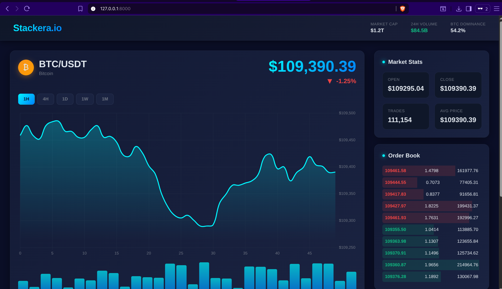

# Crypto Price WebSocket Server

This project connects to Binance’s WebSocket API to stream live crypto prices (BTC/USDT) and serves them over a local WebSocket server. You can connect multiple clients to get real-time updates.

---

## Setup & Run Instructions

### 1. Clone the Repository

```bash
git clone https://github.com/ricky08sirus/Stackera.git
cd Stackera


2. Create & Activate Virtual Environment

Linux/macOS:

python3 -m venv venv
source venv/bin/activate


Windows (PowerShell):

python -m venv venv
.\venv\Scripts\Activate.ps1


3. Install Dependencies
pip install -r requirements.txt

4. Run the Application
uvicorn app.main:app --reload

This starts the FastAPI server on:

http://127.0.0.1:8000


5. Access the Frontend

Open your browser and navigate to:

http://127.0.0.1:8000/

6. Connect to WebSocket Directly (Optional)

You can connect a WebSocket client to:

ws://127.0.0.1:8000/ws


Example (in browser console):

const socket = new WebSocket("ws://127.0.0.1:8000/ws");

socket.onopen = () => console.log("✅ Connected to WebSocket");
socket.onmessage = (event) => console.log("Price update:", JSON.parse(event.data));
socket.onclose = () => console.log("❌ Disconnected from WebSocket");

Notes

Make sure your .env file (if any) is properly configured .

The backend listens to Binance’s WebSocket and broadcasts updates to connected clients.

The frontend displays prices with live updates and charts.

```



